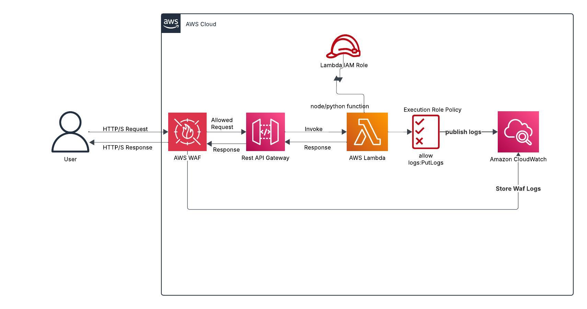

# Serverless API Patterns in AWS

## :dart: AWS Sevice Used
--------------------------------------
API Gateway(HTTP & Rest)
Lambda
IAM
WAF
Cloudwatch
--------------------------------------

## :computer: Lab Summary
1. Created Lambda Functions for Python and Node
2. Used Cloudwatch Logs to view what happened with both functions
3. Added an API Gateway and had Lambda execute code created in response to HTTP request.
4. Reviewed Logs to see what is happening behind the scenes.
5. Also added WAF as a first line of protection before anything hits
the API Gateway by implementing rules and verifying it.